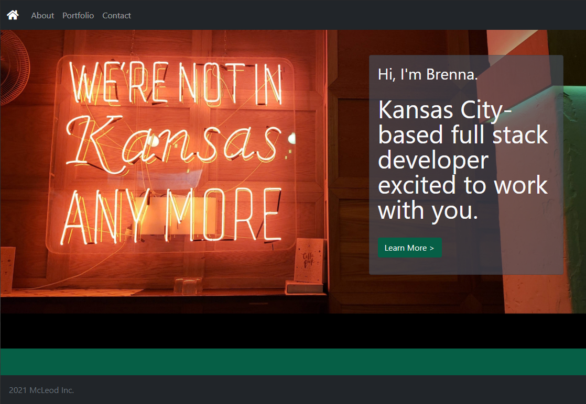
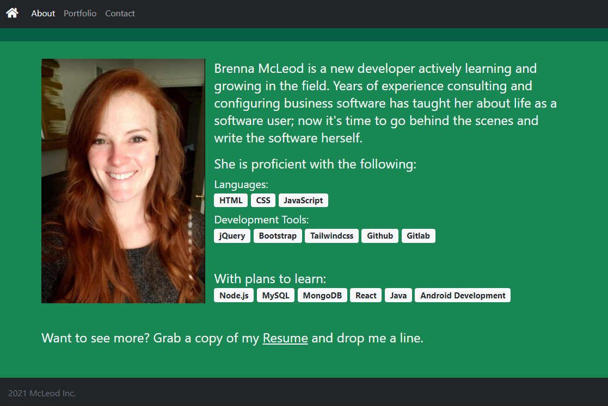
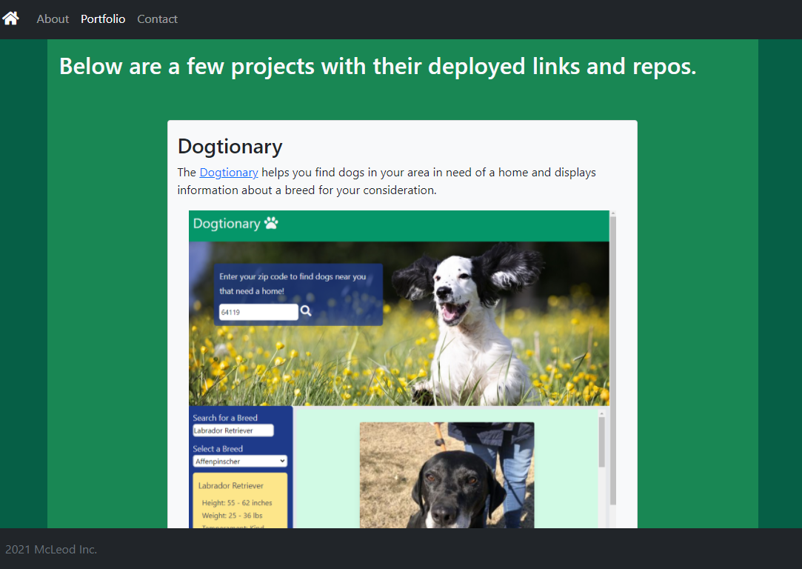
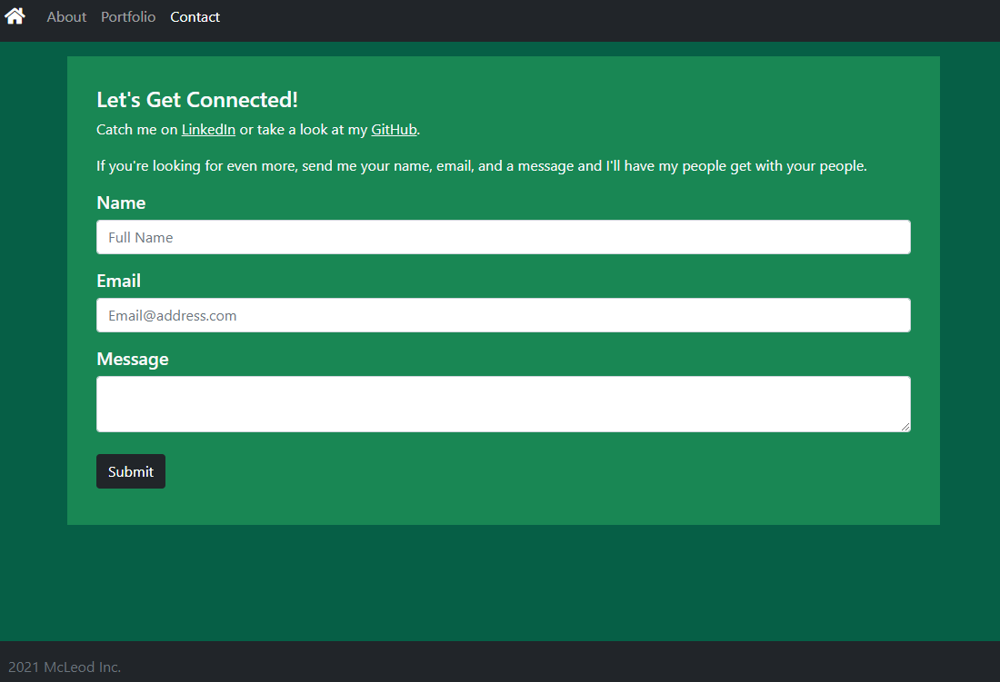

# Portfolio
https://bmcleod12.github.io/mcleod-portfolio

## Description
This portfolio showcases my skills learned and projects created during the KU Coding Bootcamp.

## Installation
Project files includes:
* HTML files that leverage the Bootstrap and TailwindCSS libraries
* An assets folder with images used in the site
No real special steps were needed for implementation aside from referencing Bootstrap, Popper, and JS

## Usage 
Open the webpage to poke around: https://bmcleod12.github.io/mcleod-portfolio

The Home page displays a cover photo with a link to the About page.

The About page features a brief introduction and a list of proficiencies, as well as a link to download my resume.

The Portfolio page features project completed during the KU Coding Bootcamp.

The Contact page features forms that (one day) enable you to send an email to me.

## Tests
Test 1:
With the page open, click each link in the navigation bar at the top left of the screen and confirm the site switches to the appropriate page. Confirm the page clicked in the menu remains lit up (active).

Test 2:
Open the page in different browsers to confirm each element of the page renders as expected.

Test 3:
Change the screen size and confirm the page elements respond to the viewport size, including images.

## Future Enhancements
1. Update the Submit button on the Contact page to be functional
2. Add to the Portfolio page with more and complex projects

## License

MIT License

Copyright (c) 2021 KU Boot Camp

Permission is hereby granted, free of charge, to any person obtaining a copy
of this software and associated documentation files (the "Software"), to deal
in the Software without restriction, including without limitation the rights
to use, copy, modify, merge, publish, distribute, sublicense, and/or sell
copies of the Software, and to permit persons to whom the Software is
furnished to do so, subject to the following conditions:

The above copyright notice and this permission notice shall be included in all
copies or substantial portions of the Software.

THE SOFTWARE IS PROVIDED "AS IS", WITHOUT WARRANTY OF ANY KIND, EXPRESS OR
IMPLIED, INCLUDING BUT NOT LIMITED TO THE WARRANTIES OF MERCHANTABILITY,
FITNESS FOR A PARTICULAR PURPOSE AND NONINFRINGEMENT. IN NO EVENT SHALL THE
AUTHORS OR COPYRIGHT HOLDERS BE LIABLE FOR ANY CLAIM, DAMAGES OR OTHER
LIABILITY, WHETHER IN AN ACTION OF CONTRACT, TORT OR OTHERWISE, ARISING FROM,
OUT OF OR IN CONNECTION WITH THE SOFTWARE OR THE USE OR OTHER DEALINGS IN THE
SOFTWARE.